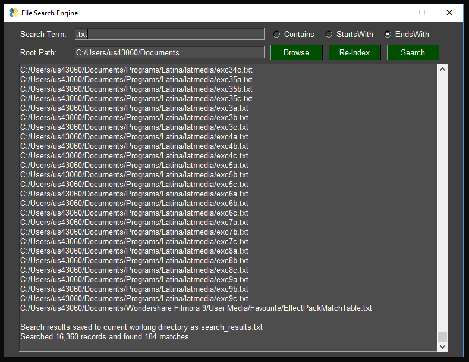

# File-Search-Engine
A simple GUI based utility to index and search local files with an Apple-style aesthetic. The GUI features a clean, modern design inspired by Apple's design principles.

Features:
- Search options include: 'contains', 'startswith', and 'endswith'
- **Re-index** saves a local copy of the index for quick re-use. This makes subsequent searches nearly instant.
- Scope the domain of your search by browsing to a higher level root directory using the **Browse** button.
- Search results are both printed to screen and exported to a text file in the working directory.
- **New Apple-style UI features:**
  - Clean, minimalist design with ample white space
  - Dark/light mode toggle
  - Search history with dropdown
  - Improved typography and visual hierarchy
  - Apple-inspired color scheme and icons

  
**Requirements** [PySimpleGUI](https://pysimplegui.readthedocs.io/en/latest/) for the GUI `pip install PySimpleGUI`
 
 
